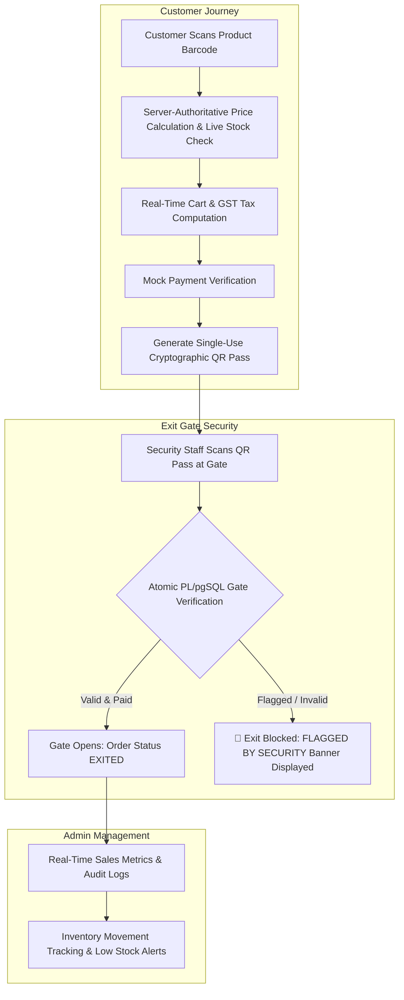

# 🛒 Scan2Go — Smart Supermarket Self-Checkout & Store Management Platform

[](https://scan2go-kappa.vercel.app)
[](https://nodejs.org/)
[](https://expressjs.com/)
[](https://supabase.com/)
[]()
[]()

**Scan2Go** is a full-stack, enterprise-grade smart supermarket self-checkout platform built with **Node.js, Express, and Supabase PostgreSQL**. It transforms retail shopping by enabling customers to scan product barcodes directly off store shelves with their smartphone camera, manage their shopping cart with server-authoritative price enforcement, complete digital payments, and exit through automated store gates using single-use cryptographic QR passes.

---

## 🌐 Live Deployment

* 🔗 **Live Web Application**: [https://scan2go-kappa.vercel.app](https://scan2go-kappa.vercel.app)
* 🐙 **GitHub Repository**: [https://github.com/AbhishekS200607/scan2go](https://github.com/AbhishekS200607/scan2go)

---

## 🔄 System Architecture & Flow



---

## 🌟 Key Features

### 📱 1. Customer Self-Checkout Experience
* **Browser Camera Scanner**: Real-time camera scanning for **EAN-13, EAN-8, UPC-A, and Code 128** barcodes with sound feedback, torch toggle, and manual input fallback.
* **Price Security Guarantee**: Cart totals, subtotals, and 5% GST are computed server-side directly from database prices. Untrusted client price tampering attempts are safely ignored.
* **Digital Tax Invoice**: Itemized tax receipts preserving exact snapshots of product names, unit prices, and barcodes even if products are later updated or deactivated.
* **Security Flagged Protection**: Prominent alert banner (`🚨 FLAGGED BY SECURITY — DO NOT GO OUTSIDE`) displayed if an order is flagged for manual secondary inspection.

### 🛡️ 2. Security Staff Exit Gate Portal
* **Automated QR Gate Scanner**: Security staff camera scanner to verify customer exit passes in milliseconds.
* **Single-Use Pass Protection**: Cryptographic 64-character tokens backed by PL/pgSQL atomic `FOR UPDATE` row locks to prevent replay attacks and double-scanning.
* **Security Verification Audit Logs**: Comprehensive history of all valid, expired, and flagged exit verification attempts.

### 📊 3. Admin & Inventory Management
* **Analytics Dashboard**: Live revenue metrics, total orders processed, active product counts, low stock alerts, and recent transaction feeds.
* **Product Catalog CRUD**: Add, edit, and soft-deactivate products with automatic stock adjustment tracking.
* **Inventory Audit Trail**: Every stock change creates a timestamped record in `inventory_movements` tracking previous quantity, change amount, new quantity, and reason.

---

## 🔐 Pre-seeded Demo Accounts

Use these pre-configured credentials to test all 3 role perspectives:

| Role | Email | Password | Allowed Capabilities |
| :--- | :--- | :--- | :--- |
| 🛒 **Customer** | `customer@scan2go.com` | `customer123` | Camera Barcode Scanning, Cart, Checkout, QR Pass, Order History |
| 🛡️ **Security Staff** | `security@scan2go.com` | `security123` | Exit Gate Scanner, QR Verification, Gate Audit Logs |
| 👑 **Administrator** | `admin@scan2go.com` | `admin123` | Dashboard Analytics, Product CRUD, Stock Adjustments, Audit Logs |

---

## 🏬 Demo Product Barcodes for Camera Scanning

Print or display these barcodes on another screen to test physical camera scanning:

| Product Name | Barcode | Category | Unit Price |
| :--- | :--- | :--- | :--- |
| **Farm Fresh Whole Milk 1L** | `8901234567890` | Dairy | ₹68.00 |
| **Multi-Grain Whole Wheat Bread 400g** | `8901234567894` | Bakery | ₹55.00 |
| **Sparkling Orange Juice 1L** | `8901234567896` | Beverages | ₹145.00 |
| **Crispy Potato Chips 150g** | `8901234567899` | Snacks | ₹60.00 |
| **Organic Basmati Rice 5kg** | `8901234567902` | Staples | ₹650.00 |
| **Dark Chocolate Bar 100g** | `8901234567905` | Snacks | ₹120.00 |

---

## 🔌 API Endpoint Reference

| Method | Endpoint | Access Role | Description |
| :--- | :--- | :--- | :--- |
| `POST` | `/api/auth/login` | Public | Authenticate user & receive JWT token |
| `POST` | `/api/auth/register` | Public | Register new customer account |
| `GET` | `/api/products/barcode/:barcode` | Customer / All | Resolve barcode to product details |
| `GET` | `/api/cart` | Customer | Get customer's current shopping cart |
| `POST` | `/api/cart/items` | Customer | Add/update item quantity in cart |
| `DELETE` | `/api/cart/items/:id` | Customer | Remove single item from cart |
| `DELETE` | `/api/cart` | Customer | Clear entire cart |
| `POST` | `/api/orders` | Customer | Create pending order from cart items |
| `GET` | `/api/orders` | Customer | Get customer's order history |
| `GET` | `/api/orders/:id` | Customer / Admin | Get detailed invoice for specific order |
| `POST` | `/api/payments/verify` | Customer | Verify payment & generate QR exit pass |
| `POST` | `/api/security/verify` | Security Staff | Verify QR exit pass at store gate |
| `GET` | `/api/admin/dashboard` | Administrator | Get revenue metrics & stock alerts |
| `GET` | `/api/admin/products` | Administrator | List all products (including inactive) |
| `POST` | `/api/admin/products` | Administrator | Create new product |
| `PATCH` | `/api/admin/products/:id` | Administrator | Update product details |
| `POST` | `/api/admin/inventory/adjust` | Administrator | Adjust stock quantity with audit log |

---

## 🛠️ Local Development Setup

### 1. Prerequisites
* **Node.js**: v18.0.0 or higher
* **npm**: v9.0.0 or higher

### 2. Clone & Install Dependencies
```bash
git clone https://github.com/AbhishekS200607/scan2go.git
cd scan2go
npm install
```

### 3. Environment Setup
Copy `.env.example` to `.env`:
```bash
cp .env.example .env
```
*(Scan2Go features a dual-engine architecture: if Supabase credentials are not set, it runs with a pre-seeded local database engine for immediate offline testing)*

### 4. Database Setup (Supabase PostgreSQL)
1. Open your Supabase Project SQL Editor.
2. Execute `supabase/migrations/001_initial_schema.sql` to create tables, indexes, constraints, and atomic stored procedures.
3. Execute `supabase/seed.sql` to populate categories and product catalogs.

### 5. Start Development Server
```bash
npm start
```
Open [http://localhost:5000](http://localhost:5000) in your browser.

---

## 🧪 Automated Integration Testing

Scan2Go includes a comprehensive 14-phase automated integration test suite covering **24 test assertions**:

```bash
npm test
```

### Coverage Highlights:
* ✅ Authentication, JWT verification, and RBAC role isolation (`HTTP 403`).
* ✅ Barcode lookup and stock availability validation.
* ✅ Server-authoritative tax and cart total calculations.
* ✅ Protection against untrusted client price manipulation (ignores client-supplied prices).
* ✅ Single-use cryptographic QR pass generation and atomic PL/pgSQL exit gate scans.
* ✅ Historical invoice snapshot preservation across product edits.
* ✅ Concurrent gate scan protection and re-verification handling.

---

## 📄 License

Distributed under the **ISC License**. Designed and developed for Smart Supermarket Self-Checkout & Retailing.
