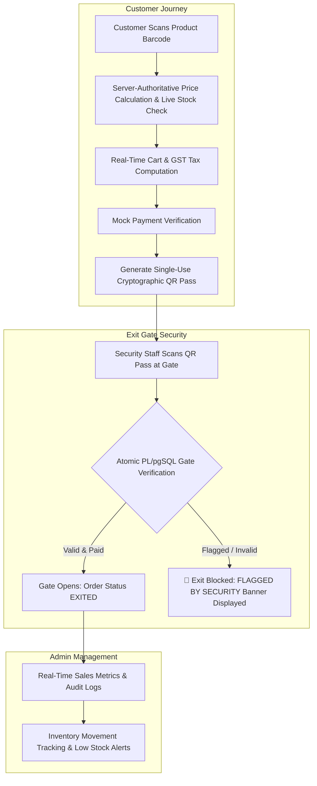

# Scan2Go 🎯

[](https://scan2go-kappa.vercel.app)
[](https://nodejs.org/)
[](https://expressjs.com/)
[](https://supabase.com/)

## Basic Details
### Team Name: Codezilla

### Team Members
- Team Lead: Abhishek S - CEMP

### Project Description
Scan2Go is a full-stack, enterprise-grade smart supermarket self-checkout platform built with **Node.js, Express, and Supabase PostgreSQL**. It transforms retail shopping by enabling customers to scan product barcodes directly off store shelves with their smartphone camera, manage their shopping cart with server-authoritative price enforcement, complete digital payments, and exit through automated store gates using single-use cryptographic QR passes.

### The Problem (that doesn't exist)
Supermarket checkout queues are unnecessarily slow, and manual barcode scanning by cashiers forces shoppers to wait in line just to buy a few items. Existing self-checkout kiosks are expensive for store owners and stationary for shoppers.

### The Solution (that nobody asked for)
Turn every shopper's smartphone into a self-checkout terminal! Customers scan product barcodes directly off store shelves using their mobile web browser camera, pay digitally, and pass through gate security using single-use cryptographic QR exit passes verified atomically by store security staff.

---

## Technical Details

### Technologies/Components Used

For Software:
- **Languages used**: JavaScript (ES6+), HTML5, CSS3, SQL (PL/pgSQL)
- **Frameworks used**: Express.js, Node.js
- **Libraries used**: Supabase JS Client (`@supabase/supabase-js`), `jsonwebtoken`, `bcryptjs`, `dotenv`, `cors`
- **Tools used**: Vercel (Deployment), Git/GitHub, npm, VS Code

For Hardware:
- **Camera Device**: Smartphone or Webcam for real-time barcode & QR pass scanning.

---

### Implementation

For Software:

# Installation
```bash
# Clone the repository
git clone https://github.com/AbhishekS200607/scan2go.git
cd scan2go

# Install dependencies
npm install

# Setup environment variables
cp .env.example .env
```

# Run
```bash
# Start the development server
npm start
```
*Open [http://localhost:5000](http://localhost:5000) in your browser.*

---

### Project Documentation

For Software:

# Screenshots

*Customer Barcode Scanner & Cart Management interface*


*Security Staff QR Exit Gate Pass Scanner*


*Admin Dashboard & Real-Time Stock Analytics*

# Diagrams

*System Workflow: From customer barcode scan to cryptographic exit gate verification*

---

### Project Demo

# Video
[Add your demo video link here]
*Demonstration of mobile barcode scanning, digital checkout, and exit gate verification*

# Additional Demos
- 🔗 **Live Web Application**: [https://scan2go-kappa.vercel.app](https://scan2go-kappa.vercel.app)
- 🐙 **GitHub Repository**: [https://github.com/AbhishekS200607/scan2go](https://github.com/AbhishekS200607/scan2go)

---

## 🔐 Pre-seeded Demo Accounts

| Role | Email | Password | Allowed Capabilities |
| :--- | :--- | :--- | :--- |
| 🛒 **Customer** | `customer@scan2go.com` | `customer123` | Camera Barcode Scanning, Cart, Checkout, QR Pass, Order History |
| 🛡️ **Security Staff** | `security@scan2go.com` | `security123` | Exit Gate Scanner, QR Verification, Gate Audit Logs |
| 👑 **Administrator** | `admin@scan2go.com` | `admin123` | Dashboard Analytics, Product CRUD, Stock Adjustments, Audit Logs |

---

## Team Contributions
- **Abhishek S**: Full-Stack Development, Database Schema, System Architecture & Security Gate Logic

---
Made with ❤️ at TinkerHub Useless Projects 


